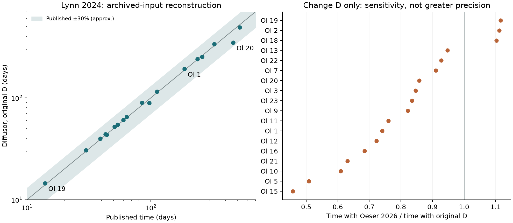
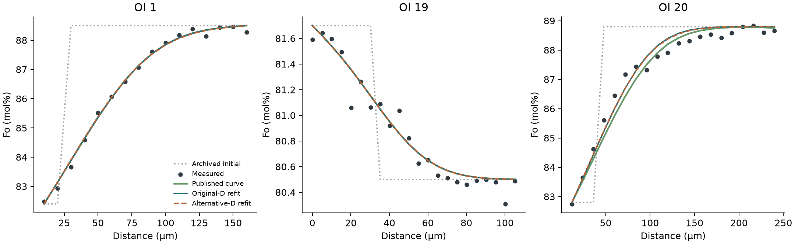

# Published-study validation — 8 October 2026

492 measured profiles from twelve downloaded studies are available in **File > Published validation library**. 18 Lynn olivine profiles and 20 Iovine sanidine profiles also have ready-to-run model presets in the usual example list. The remaining library entries are explicitly data-only. They require model setup before fitting.

## What replicated

**Lynn et al. (2024): all 18 single-event reconstructions lie within the published uncertainty intervals.** Refit/published time ratios range from 0.753 to 1.056. This is agreement under the archived inputs, not bit-for-bit replication of the authors’ MATLAB discretisation or uncertainty calculation. Ol 8 has two events and is excluded from the single-duration comparison.

**Changing only D changes the Lynn times by -54.2% to +11.6%.** The alternative is Oeser, Dohmen & Weyer (2026), the registry’s interdiffusion law derived from its Fe and Mg tracer laws. It is not a tracer coefficient substituted directly into an exchange model. The calibration is at atmospheric pressure, approximately 10⁻⁵ Pa fO₂, high silica activity and 1100–1250 °C. The Lynn runs use 42 MPa and log fO₂ = −3.2 Pa, so the comparison extrapolates the calibration. Newer does not establish greater precision, and no narrower uncertainty interval is claimed.



## Lynn setup and results

The workbook supplies T = 1200 °C, P = 42 MPa, log₁₀ fO₂ = −8.2 bar, three EBSD angles, measured Fo, Initial and Model columns, and published times. The article states 45 MPa; the workbook is used here. Both fits use the same data, uniform weights, plane geometry, fixed endpoint compositions, composition-dependent D and the archived initial values linearly interpolated between measurement positions. Fo is modelled in mol% with XFe = 1 − Fo/100. Only duration is fitted. Rows without an archived initial/model value are retained in the raw CSV but excluded from the model domain. No beam correction, additional free interface, inferred plateau or cooling path is added. The sub-grid sharp interface and original numerical grid are not published. The paper writes Fick’s second law as ∂C/∂t = D ∂²C/∂x² (eq. 1) and makes D depend on X_Fe (eq. 2); Diffusor solves ∂C/∂t = ∂/∂x(D ∂C/∂x) with its finite-volume solver on 401 nodes. The source model curves are therefore also compared directly. The workbook’s log₁₀ fO₂ = −8.2 bar is used as printed; the paper’s Methods name QFM+0.4, which Diffusor’s QFM buffer puts at −7.87 bar at 1200 °C and 42 MPa.

| Crystal | Published ± interval (d) | Original-D refit (d) | Alternative-D refit (d) | Alternative/original |
|---|---:|---:|---:|---:|
| Ol 1 | 187 ± 56 | 192.47 | 142.62 | 0.741 |
| Ol 2 | 30 ± 9 | 30.58 | 33.99 | 1.112 |
| Ol 3 | 64 ± 19.2 | 64.89 | 54.94 | 0.847 |
| Ol 5 | 238 ± 71.4 | 239.84 | 121.97 | 0.509 |
| Ol 7 | 43 ± 12.9 | 43.90 | 39.98 | 0.911 |
| Ol 9 | 97 ± 29.1 | 89.34 | 73.39 | 0.822 |
| Ol 10 | 326 ± 97.8 | 336.49 | 204.98 | 0.609 |
| Ol 11 | 39 ± 11.7 | 39.88 | 30.33 | 0.761 |
| Ol 12 | 51 ± 15.3 | 52.17 | 37.70 | 0.723 |
| Ol 13 | 60 ± 18 | 60.54 | 57.34 | 0.947 |
| Ol 15 | 521 ± 156.3 | 492.36 | 225.44 | 0.458 |
| Ol 16 | 54 ± 16.2 | 54.51 | 37.34 | 0.685 |
| Ol 18 | 112 ± 33.6 | 114.84 | 126.63 | 1.103 |
| Ol 19 | 14 ± 4.2 | 14.53 | 16.22 | 1.116 |
| Ol 20 | 463 ± 138.9 | 348.64 | 299.10 | 0.858 |
| Ol 21 | 85 ± 25.5 | 89.74 | 56.62 | 0.631 |
| Ol 22 | 44 ± 13.2 | 43.37 | 40.26 | 0.928 |
| Ol 23 | 259 ± 77.7 | 252.74 | 211.13 | 0.835 |

The largest difference from the archived model curve at its published time is 0.096 Fo mol% RMS. Ol 20 has the largest time discrepancy (about 25% shorter). It remains a discrepancy even though it is inside the reported interval. Doubling the grid to 801 nodes for Ol 1 and Ol 9 changes fitted times by less than 0.004%. This checks numerical convergence for those cases, not the unknown source initial-interface placement.



Full curves: [fits/](fits/). Machine-readable fit results and calibration warnings: [results.json](results.json). Grid checks: [convergence.json](convergence.json).

## Iovine et al. (2017): sanidine Ba at Agnano-Monte Spina

**23 greyscale and X-ray traverses give 0.90–1.28 times the published times (median 0.99); 18 round to the published whole year.** The paper fits each traverse with the erfc solution of a sharp step whose two plateaus continue (Fig. 5e), with the Cherniak (2002) Ba law (D₀ = 0.29 m²/s, 455 kJ/mol, Fig. 5f) at 930 °C, the average two-feldspar temperature (p. 7–8). Diffusor uses the same law, temperature and initial step, and fits the time, the step position and both plateaus. D is constant, so a linear calibration of grey values or count rates to Ba does not change the time, and the values are fitted as recorded. The workbooks and Fig. 4 label distances “mm”; the values are micrometres. Table labels “L1 2°” and “L1 2nd” are read as the second profile of line 1; the fits support that reading but the paper does not define the suffix. The EMP BaO times of Table 1 were fitted to parts of the 10 µm traverses that are not tabulated, so those traverses are data only. Two traverses cross two compositional steps (A cx5 greyscale line 1, B cx1 X-ray); for the X-ray scan the inner step gives 2.1–2.7 yr and the outer step 4.4 yr, against 5 yr in Table 2. They are data only.

| Traverse | Table | Published (yr) | Diffusor (yr) | Ratio |
|---|---|---:|---:|---:|
| A CX4 grey L2 | Table 1, A cx4_L2 | 16 | 15.89 | 0.99 |
| A CX5 grey L2 P1 | Table 1, A cx5_L2 | 9 | 9.25 | 1.03 |
| A CX5 grey L2 P2 | Table 1, A cx5_L2 2° | 1 | 1.28 | 1.28 |
| A CX6 grey L1 | Table 1, A cx6 | 6 | 5.53 | 0.92 |
| B CX1 grey L1 P1 | Table 1, B cx1_L1 | 4 | 3.60 | 0.90 |
| B CX1 grey L1 P2 | Table 1, B cx1_L1 2° | 2 | 2.33 | 1.16 |
| B CX1 grey L2 P1 | Table 1, B cx1_L2 | 23 | 22.40 | 0.97 |
| B CX1 grey L2 P2 | Table 1, B cx1_L2 2° | 4 | 3.67 | 0.92 |
| B CX2 grey L1 | Table 1, B cx2_L1 | 5 | 4.66 | 0.93 |
| B CX2 grey L2 | Table 1, B cx2_L2 | 5 | 5.05 | 1.01 |
| B CX2 xray L1 P1 | Table 2, B Bcx2_L1 | 20 | 19.80 | 0.99 |
| B CX2 xray L1 P2 | Table 2, B Bcx2_L1 2nd | 23 | 25.21 | 1.10 |
| B CX3 grey | Table 1, B cx3 | 33 | 33.25 | 1.01 |
| B CX10 grey L1 P1 | Table 1, B cx10_L1 | 15 | 14.64 | 0.98 |
| B CX10 grey L1 P2 | Table 1, B cx10_L1 2° | 24 | 23.79 | 0.99 |
| B CX10 grey L2 | Table 1, B cx10_L2 | 8 | 7.97 | 1.00 |
| B CX10 xray P1 | Table 2, B Bcx10_L1 | 4 | 4.36 | 1.09 |
| B CX10 xray P2 | Table 2, B Bcx10_L2 | 7 | 7.82 | 1.12 |
| D CX3 grey L2 | Table 1, D cx3_L2 | 32 | 31.53 | 0.99 |
| D CX6 grey L1 | Table 1, D cx6_L1 | 151 | 149.41 | 0.99 |
| D CX6 grey L2 | Table 1, D cx6_L2 | 95 | 93.30 | 0.98 |
| DCX7 grey | Table 1, D cx7 | 8 | 7.87 | 0.98 |
| DCX7 xray | Table 2, D Dcx7 | 3 | 3.23 | 1.08 |

Traverses with at least ten points (20) are presets in the example list under K-feldspar. The paper gives no uncertainty for single times; Fig. 7 shows the effect of ±26.5 °C. [Results](iovine_results.json).

## Other executable checks

**Gordeychik et al. (2018).** All 32 published Fo age rows in Tables SM4-A, SM5-A and SM6-A reproduce to relative error below 4×10⁻¹⁶. These checks use the published fitted diffusion widths or Dt products and geometric factors. They verify the conversion into ages, not a new fit to the raw profiles or the jointly inferred growth/resorption geometry. The original registry D is about 0.3% below the spreadsheet D, largely reflecting literal constants (2.303 versus ln 10 and the gas constant). The reported width checks use the source D rather than hiding that distinction.

Equation SM4.4 of the supplement gives t = Δ²_Ni/(4D_Ni). In Table SM4-A, column O (higher D_Ni) computes this, while cells P4:P8 (lower D_Ni) multiply ΔFo × ΔNi. Diffusor reads P4:P8 as a slip in the spreadsheet formula and follows equation SM4.4, which gives values 7.4–7.6% lower in those five cells. Column P does not enter the table’s resulting time intervals, which take columns O and L. The spreadsheet formulas and the equation SM4.4 values are both kept in the results file.

Where an unambiguous a/b/c orientation match exists, changing D to Oeser gives 0.475–1.480 times the published Fo age. The new anisotropy is projected separately; the old sixfold geometric factor is not reused. An orientation is paired with an age row only when the sample name and the geometric factor both agree with Table SM2-B. 7 of 32 rows have no such match (for example, the age row for Ol-8-2 uses the factor 0.2539 that SM2-B lists for Ol-8-3). Those rows keep the age check but have no alternative-D result. At 0.6–1 GPa, these alternative coefficients are pressure extrapolations. [Source parameters and literal formulas](gordeychik_parameters.json), [results](gordeychik_results.json).

**Ostorero et al. (2022).** The existing K9_L10C4 EPMA example gives 2.51 yr with Ganguly & Tazzoli (1994) and 11.84 yr with Dias et al. (2025), versus 2.32 yr published. This is an EPMA surrogate for the authors’ BSE fit, with the existing window, 850 °C, NNO+1.3, b-axis and beam correction held fixed. The newer-law result includes temperature/fO₂ extrapolation. [Results](ostorero_results.json).

**Araya et al. (2024).** The stated log₁₀D = −19.78 is recovered as -19.78233 with the original law at 966 °C, NNO, a-axis and no composition correction. The paper specifies perpendicular to c, which does not uniquely identify a or b. The 1-bar buffer reference is a computational assumption. Alternative-D factors are conditional on orientation and composition, not new ages. [Assumptions and D-only comparison](araya_results.json).

**Mourey et al. (2023), 3311_2_ol6.** A conditional Fo-only reconstruction gives 406.4 days with the Dohmen & Chakraborty (2007) law as corrected by its erratum, versus 395 (+149/−106) days published, and 305.0 days with Oeser D. Equation 3 of the paper gives fO₂ = 10^(8.912−25160/T) “in Pa”, for the QFM buffer named in the text. Read in bar, the expression is −8.37 at 1183 °C, 0.09 log units from Diffusor’s QFM (−8.45 bar at 60 MPa); read in Pa it lies about 5 log units below QFM. Diffusor reads it in bar. Equation 2 prints the composition term as `3(X_Mg−0.9)`; Dohmen & Chakraborty (2007, erratum) give `3(X_Fe−0.1)`, which Diffusor uses. Taking both printed forms at face value gives 2226 days in this reconstruction. The 406-day result rests on these two readings. It does not establish what the authors’ code used. The initial rim position is fitted to Fo alone here, whereas the paper used Ca and Ni as additional constraints. [All three branches and assumptions](mourey_results.json).

**Chamberlain et al. (2014).** The supplement holds no numeric traverses. In Electronic Appendix 7 the columns headed “+ timescale (−30 °C)” and “− timescale (+30 °C)” are the best-fit time scaled by D(T)/D(T∓30 K). With the Table 1 laws (Sr 8.4 m²/s and 450 kJ/mol, Ba 0.29 m²/s and 455 kJ/mol, Ti 7×10⁻⁸ m²/s and 273 kJ/mol) they recompute for all 17 Sr, 54 Ba and 151 Ti rows to within 1×10⁻⁴ of the stored values. They are absolute times at the two temperatures, not increments.

**Petrone et al. (2018).** Table S4 gives √(4Dt) and T for each modelled boundary. For the 71 rows fitted with the semi-infinite erf, t = (√(4Dt))²/4D with the Dimanov & Sautter (2000) values printed in Supplementary Material 1 (p. 13: D₀ = 9.5×10⁻⁵ m²/s, 406 kJ/mol) reproduces 62 printed times within 5% or rounding (median ratio 1.006). The other 9 are listed in the results file. 19 rows use the finite-reservoir solution of NIDIS and are not recomputed. Diffusor’s registry entry for this law carries D₀ = 9.55×10⁻⁵ m²/s, the value that reproduces the D values printed by Petrone et al. (2016); the check uses the 2018 value. [Results](timescale_tables_results.json).

## Sundermeyer reconstructions: published ages not reproduced

These runs are executable sensitivity examples, not verified GUI presets. The original point selection and parts of the setup are unavailable. Réunion uses the TaMED law, which is the fO₂ > 10⁻¹⁰ Pa expression that Chakraborty (2010, p. 617) prints and the paper cites; at NNO−0.5 that branch applies. Eifel uses an explicitly assumed log fO₂ = −5 Pa because the downloaded source does not state it.

| Study / crystal | Published (d) | TaMED reconstruction (d) | Oeser comparison (d) |
|---|---:|---:|---:|
| Réunion / 150915-1-3 | 49 | 276.73 | 351.34 |
| Réunion / 150915-1-9 | 579 | 358.12 | 248.84 |
| Eifel / E41-4-1 | 291 | 457.07 | 172.98 |

Réunion 150915-1-9 has a matching melt-inclusion temperature but a reconstructed eight-point window. Its TaMED time lies below the published interval. Extending its numerical domain changes the fit by only 0.28%, so the mismatch cannot be removed by that domain correction. 150915-1-3 also needs a proxy temperature and gives a particularly poor reproduction. Eifel’s grid refinement changes the fitted time by less than 0.02%, but its unknown fO₂ and reconstructed window remain scientific limitations. These mismatches do not establish that the published ages are wrong or that Oeser is more accurate.

[Réunion methods and limitations](reunion_notes.md), [results](reunion_results.json). [Eifel methods and limitations](eifel_notes.md), [results](eifel_results.json).

## Coverage and remaining requirements

| Study | Extracted profiles | What the downloaded material permits |
|---|---:|---|
| [Lynn et al. (2024), Kilauea 2020](https://doi.org/10.1007/s00445-024-01714-y) | 19 | 18 single-event archived-input reconstructions and alternative-D refits. Ol 8 has two events and is data-only. |
| [Mutch et al. (2019), Borgarhraun](https://doi.org/10.1038/s41561-019-0376-9) | 20 | 20 measured Fo/Ni/Mn profiles and initial arrays. Angles and posterior medians available, but no per-profile fO2 mapping and no replica of the study-specific joint Bayesian inversion. See mutch_notes.md. |
| [Mourey et al. (2023), Kilauea 2018](https://doi.org/10.1007/s00445-023-01633-4) | 56 | 56 measured traverses extracted. A single-event Fo-only reconstruction of 3311_2_ol6 is run three ways: the printed forms of equations 2 and 3, the Dohmen & Chakraborty (2007, erratum) law with equation 3 read in bar, and Oeser D. The joint Ca/Ni/Fo boundary placement of the paper is not published. |
| [Sundermeyer et al. (2020), Piton de la Fournaise](https://doi.org/10.1007/s00410-019-1642-y) | 100 | 100 measured traverses. Two explicit reconstructed-window comparisons do not reproduce the reported ages. TaMED (the Chakraborty 2010 expression the paper cites) and Oeser results retained with matching/proxy temperature provenance. See reunion_notes.md. |
| [Sundermeyer et al. (2020), Eifel](https://doi.org/10.1007/s00410-020-01715-y) | 61 | 61 measured traverses. E41-4-1 conditional comparison and grid check completed using source effective T and angles. Missing fO2 and exact event window prevent exact replication. See eifel_notes.md. |
| [Gordeychik et al. (2018), Shiveluch](https://doi.org/10.1038/s41598-018-30133-1) | 27 | Measured traverses extracted and 32 published fitted-width/Dt Fo age calculations independently recomputed. This is not an independent refit of the selected profile points. Five Ni cells of Table SM4-A follow a different formula from equation SM4.4; both versions are kept. |
| [Ruprecht & Plank (2013), Irazu](https://doi.org/10.1038/nature12342) | 11 | Normalised LA-ICPMS profiles extracted, including Ni. Full composition/fO2-dependent Ni calibration and profile masks are required for the published model; the registry's Fo90 fixed-fO2 fit is not a replacement. |
| [Ruth et al. (2018), Llaima](https://doi.org/10.1038/s41467-018-05086-8) | 22 | Measured traverses extracted from legacy XLS. Per-traverse EBSD angles and numerical initial states are not in that downloaded composition workbook. Some published models use calibrated BSE rather than the EPMA traverse. |
| [Shea et al. (2026), Kilauea Iki](https://doi.org/10.1130/GEOL.S.34036920.v1) | — | Workbook contains core/rim populations and crystal sizes, not 1-D profiles. The supplement models 3-D anisotropic crystals with evolving rim composition and lava-lake cooling histories, including pre-lake diffusion. No fabricated traverse or 1-D replacement added. |
| [Rasmussen et al. (2018), Shishaldin](https://doi.org/10.1016/j.epsl.2018.01.001) | — | Downloaded XLSX contains core/rim compositions and model-result table C.7, not the fitted BSE intensity traverses. DOCX methods/figures do not supply numerical traverses. |
| [Araya et al. (2024), Sakurajima](https://doi.org/10.1029/2023JB028558) | — | Downloaded workbooks contain crystal compositions, not the fitted BSE profiles. Recomputed the stated D and added a conditional constant-D comparison, not new ages. |
| [Ban et al. (2026), Azumayama](https://doi.org/10.1186/s40623-025-02356-w) | — | Supplement contains plotted BSE profiles and model curves, not numeric profile tables. Digitisation and image calibration would be approximate and have not been represented as exact source data. |
| [Ostorero et al. (2022), Kizimen](https://doi.org/10.1038/s43247-022-00622-3) | — | Existing measured K9_L10C4 example retained and rechecked with original and Dias 2025 laws. EPMA surrogate for the published BSE fit. |
| [Sievwright et al. (2020), magnetite experiments](https://doi.org/10.1007/s00410-020-01679-z) | — | Experimental coefficient source already represented by the registry and existing source tests, rather than a new natural-timescale application. |
| [Iovine et al. (2017), Agnano-Monte Spina](https://doi.org/10.1007/s00445-017-1101-4) | 43 | 23 greyscale and X-ray traverses refitted with the paper’s law (Cherniak 2002), 930 °C and a sharp initial step with free plateaus: 0.90–1.28 times the Table 1 and 2 times. The 20 with at least ten points are presets. The EMP BaO traverses and two traverses that cross two steps are data only, because the fitted part is not published. |
| Lynn et al., Mauna Loa 2022 (supplementary workbook) | 59 | 59 olivine traverses with the workbook’s T, P, log fO₂, EBSD angles and median times (sheet S6). The workbook names no diffusion law and the article is not in the local source set, so the traverses are data only. The two pyroxene sheets are not extracted. |
| [Sato et al. (2022), Zao](https://doi.org/10.1016/j.jvolgeores.2022.107686) | 58 | 58 EPMA pyroxene traverses (Supplementary Table 8). Seven crystals have EPMA-based times in Supplementary Table 9 (Dohmen et al. 2016 law as printed on p. 11, 1025 °C, NNO). The fitted part of each traverse and the step position are not published, and erf fits to different parts of one traverse differ by more than an order of magnitude, so the traverses are data only. |
| [Morgado et al. (2019), Calbuco](https://doi.org/10.1007/s00410-019-1596-0) | 16 | 16 titanomagnetite traverses from ilmenite–titanomagnetite pairs (SM1). The paper models them with the Aragon et al. (1984) point-defect law and an interface at equilibrium. The domain length, far boundary and forward model are not published, and the Table 3 times are minimum re-equilibration times of nearly flat profiles, so the traverses are data only. |
| [Chamberlain et al. (2014), Bishop Tuff](https://doi.org/10.1007/s00410-014-1034-2) | — | No numeric traverses: the profiles are shown as figures in the electronic appendices. The ±30 °C columns of Electronic Appendix 7 (17 Sr, 54 Ba and 151 Ti rows) recompute from the Table 1 laws to within 1×10⁻⁴. |
| [Petrone et al. (2018), Stromboli](https://doi.org/10.1016/j.epsl.2018.03.055) | — | No numeric traverses. 62 of 71 semi-infinite rows of Table S4 recompute from √(4Dt), T and the Dimanov & Sautter (2000) values printed in Supplementary Material 1 (D₀ = 9.5×10⁻⁵ m²/s, 406 kJ/mol) within 5% or rounding. The other nine are listed in the results file. 19 finite-reservoir rows need the NIDIS finite-reservoir solution and are not recomputed. |
| [Petrone et al. (2022), Stromboli](https://doi.org/10.1038/s41467-022-35405-z) | — | Timescales are in Table 1 of the article. The downloaded supplement holds figures and spot analyses, with no numeric traverses and no erf parameters. |
| [Mangler et al. (2022), Popocatépetl](https://doi.org/10.1130/G49365.1) | — | Table S1 lists the orthopyroxene Fe–Mg times with their temperatures. The profiles are shown only as figures, so no traverse is extracted. |
| [Polo-Sanchez et al. (2023), Santorini](https://doi.org/10.3389/feart.2023.1128083) | — | The Table 1 workbook lists orthopyroxene and clinopyroxene times per zone. Data Sheet 3 shows the modelled profiles as figures only, so no traverse is extracted. |
| [Seitz et al. (2018), Patagonia](https://doi.org/10.3389/feart.2018.00095) | — | The supplementary table holds whole-rock analyses and sample locations. The NanoSIMS Ti traverses are shown only as figures. |

A workbook of core/rim compositions is not a measured diffusion traverse. A case requiring different dimensions, multiple events or a Bayesian joint inversion has not been labelled an exact replication merely because a scalar curve can be fitted. The supplements of Weller et al. (2026) and Kahl et al. (2023) have not been downloaded yet, and the article that goes with the Lynn et al. Mauna Loa 2022 workbook is not in the local source set.

## Reproduce

Run from the repository root in the project environment:

```text
python examples/validation/extract.py
python -m diffusor.validation
python examples/validation/extract_gordeychik.py
python examples/validation/check_gordeychik.py
python examples/validation/check_ostorero.py
python examples/validation/check_araya.py
python examples/validation/check_mourey.py
python examples/validation/check_reunion.py
python examples/validation/check_eifel.py
python examples/validation/check_iovine.py
python examples/validation/check_timescale_tables.py
python examples/validation/export_curves.py
python examples/validation/build_report.py
```

The extractors read the original supplementary workbooks, downloaded from the DOIs above into `papers/Supplementaries and data/<study>/`, and need openpyxl and xlrd (Ruth XLS only). check_timescale_tables.py also reads the Chamberlain and Petrone workbooks there. Install the optional extraction dependency with `python -m pip install ".[validation]"`. Fitting and checks run offline from the bundled extracted files. For the 801-node checks use `python -m diffusor.validation --key lynn2024_ol_1 --key lynn2024_ol_9 --nodes 801 --output examples/validation/convergence.json`.

Each CSV retains `source_row` (or `source_cell` for the transposed Iovine sheets); the [manifest](manifest.json) stores source file, sheet, SHA256, sample and setup status. Original order and repeated distances are preserved. Review repeated positions before using a data-only file in a model. Mutch Fo and its uncertainty were converted from mole fraction to mol%; Gordeychik distances from mm to µm. No synthetic points or interpolated measurements were inserted. [Browse every extracted profile](catalogue.md). [Independent extraction audit](data_audit.md) checked all 11,758 source rows of the first eight studies.

`tests/test_validation.py` rechecks the manifest, the Lynn model setup, the GUI preset and the Gordeychik arithmetic on every test run. Wheel contents and loading were verified in an isolated installation. [Mutch input requirements](mutch_notes.md) explain why its joint inversion has not been replaced by an assumed single-species fit.
